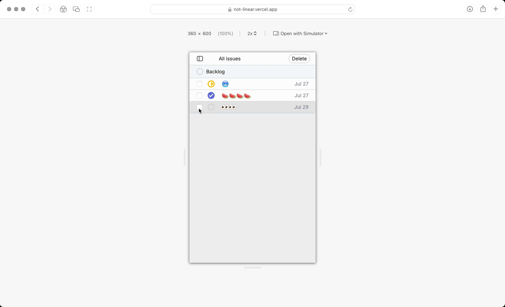

Issue tracking app.

- UI library: [React](https://react.dev)
- Types: [Typescript](https://www.typescriptlang.org)
- Styling: [Tailwind CSS](https://tailwindcss.com)
- Deployment: [Vercel](https://vercel.com), [Cloudflare](https://www.cloudflare.com)

Project goals:

1. Learn, have fun
2. Learn html
3. Learn css, motion
4. Learn tailwind
5. Learn javascript
6. Learn dom api
7. Learn react
8. Learn typescript
9. Learn routing
10. Learn asnyc programming
11. Learn error handling
12. Learn working with formatter(Prettier), linter(Eslint) and bundler(Vite)
13. Learn git and github

> **Note:** This is a passion project.

## Building & running locally

```bash
git clone https://github.com/otabek-git/not-linear.git
cd not-linear
npm install
npm run dev
```
