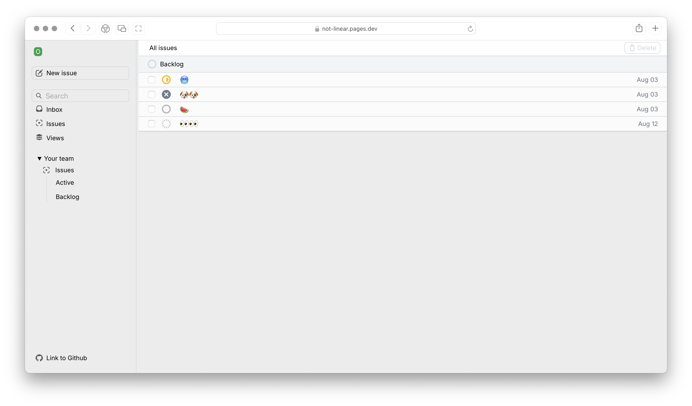
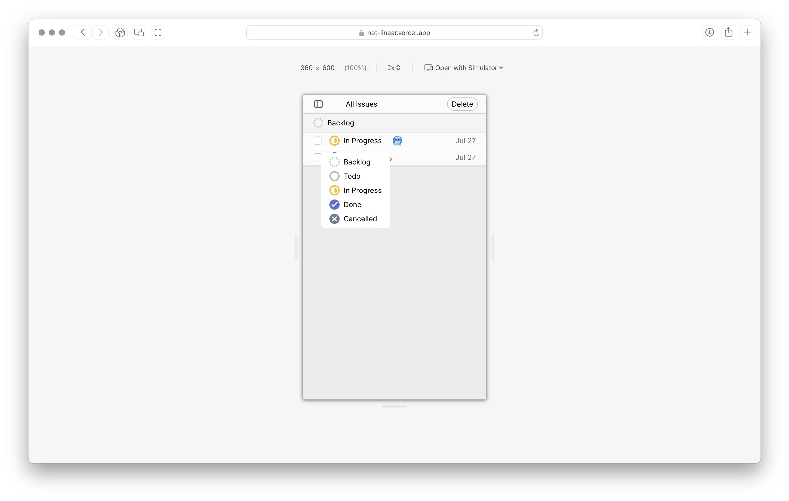
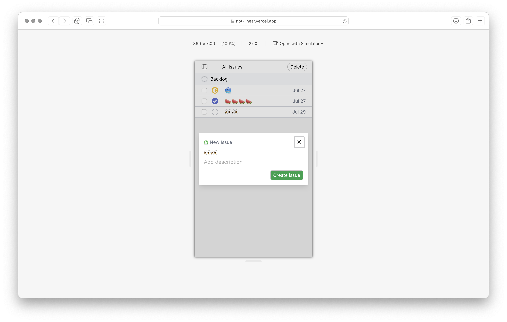
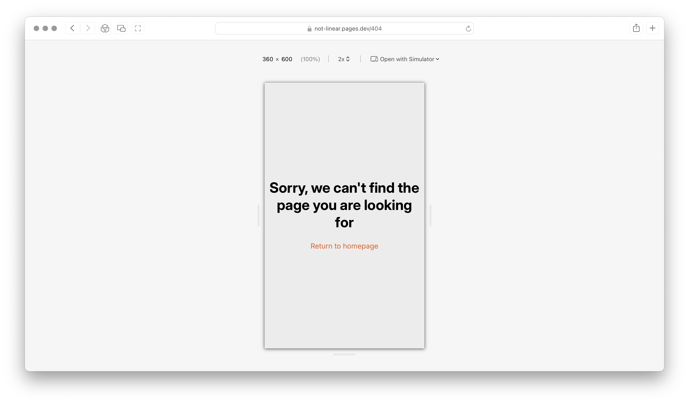

https://github.com/user-attachments/assets/0aaa9bc1-4efd-4dcb-8513-a253679d7563


https://github.com/user-attachments/assets/f4fc7209-64aa-4fbe-8fe9-8072fb244468


Issue tracking app.


Deployment: [Cloudflare](https://not-linear.pages.dev)

Project goals:

Learn ... and have fun

1. HTML
2. CSS
3. TailwindCSS
4. JavaScript
5. DOM api
6. React
7. TypeScript
8. Routing
9. Asnyc programming
10. Error handling
11. Working with formatter(Prettier), linter(Eslint) and bundler(Vite)
12. Git and Github

## Building & running locally

```bash
git clone https://github.com/otabek-git/not-linear.git
cd not-linear
npm install
npm run dev
```
