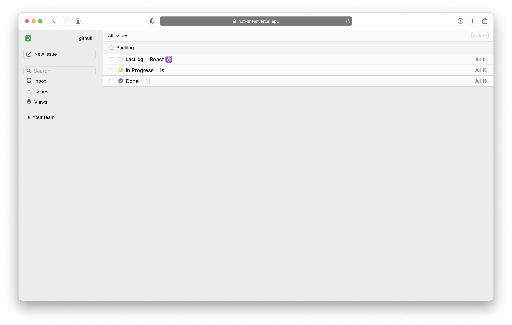

Issue tracking app.

- UI library: [React](https://react.dev)
- type hints: [Typescript](https://www.typescriptlang.org)
- styling: [Tailwind CSS](https://tailwindcss.com)
- deployment: [Vercel](https://vercel.com)

Project goals:

1. learn, have fun
2. learn react
3. learn css, motion
4. learn types (Typescript)
5. asnyc programming

> **Status of this project:** This is a passion project and thus is not "production grade" stuff.

Work in progress, TODO:

- Finish the custom select component
- Add search
- ..add real db?

## Building & running locally

```bash
git clone https://github.com/otabek-git/not-linear.git
cd not-linear
npm install
npm run dev
```
